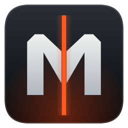

# Meridian Conflict brand kit

Use this folder for the game's public identity and community copy.
Start with the existing game icon and palette. Keep new work consistent with them.

## Assets

| File | Use | Source |
| --- | --- | --- |
| [meridian-icon.png](exports/meridian-icon.png) | Discord and small profile images; 256 × 256, transparent PNG | Largest image in the game's existing icon |
| [meridian-app.ico](source/meridian-app.ico) | Collected Windows icon, sizes 16–256 | `crates/mc-game/assets/meridian.ico` |
| [palette.json](palette.json) | Shared colors | `crates/mc-game/src/ui/mod.rs`, `palette` |
| [Voice and copy](VOICE.md) | Descriptions and writing style | Community setup, September 2026 |
| [Discord setup](community/discord.md) | Channels, roles, welcome text and maintenance | Live server setup |



The icon is a steel M split by an orange meridian line on a dark tile.
The game's source remains authoritative: `crates/mc-game/src/ui/emblem/monogram.rs`.
The copy in `source/` is a collected snapshot, not a second design master.

## Use it well

- Keep the icon square. Do not stretch, recolor, or put text over it.
- Leave space around the M. Check small sizes and round profile crops.
- Use orange for emphasis, with dark backgrounds and light text.
- Write **Meridian Conflict**. Spell out “real-time strategy” for new players.
- Say the game is **in development**. Do not promise dates or access that has not been announced.
- Use real game captures for screenshots. Label concepts as concepts.

## Collect next

Add approved wordmarks, a larger icon export, a wide header, and real gameplay
screenshots here as they become available. Record each file's creator, source,
license or permission, date, and intended use in this index. No third-party
artwork or new license grant is included in this kit.

Refresh the collected icon after the game icon changes:

```sh
cp crates/mc-game/assets/meridian.ico brand/source/meridian-app.ico
sips -s format png crates/mc-game/assets/meridian.ico --out brand/exports/meridian-icon.png
```

`sips` is built into macOS. The source icon's largest image is 256 × 256;
this export does not invent extra detail by enlarging it.
